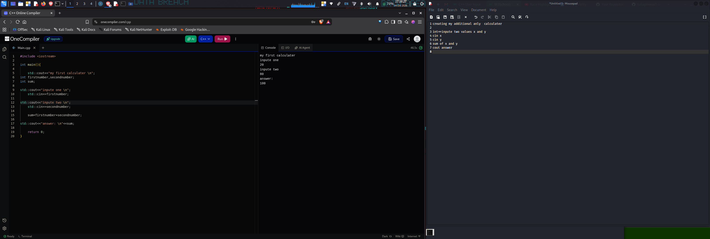
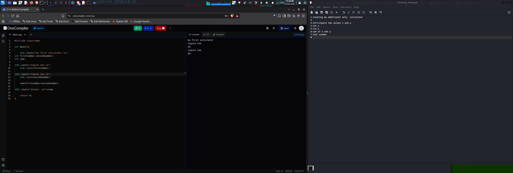
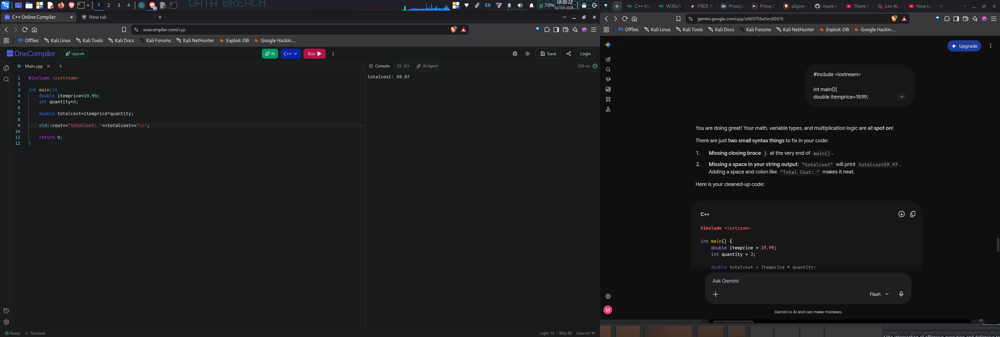
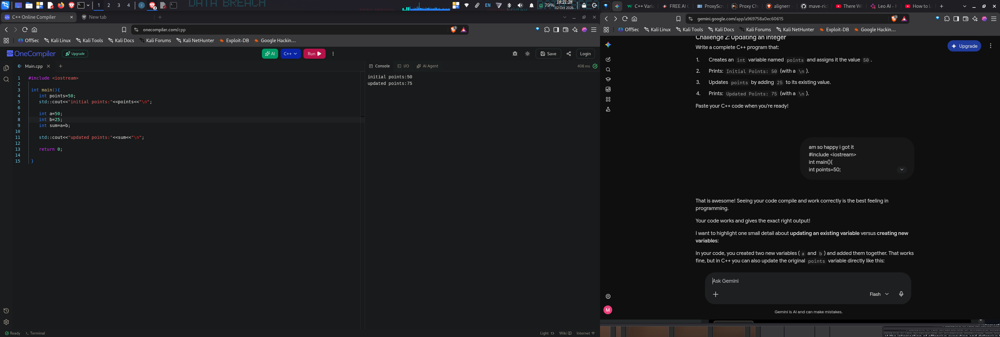
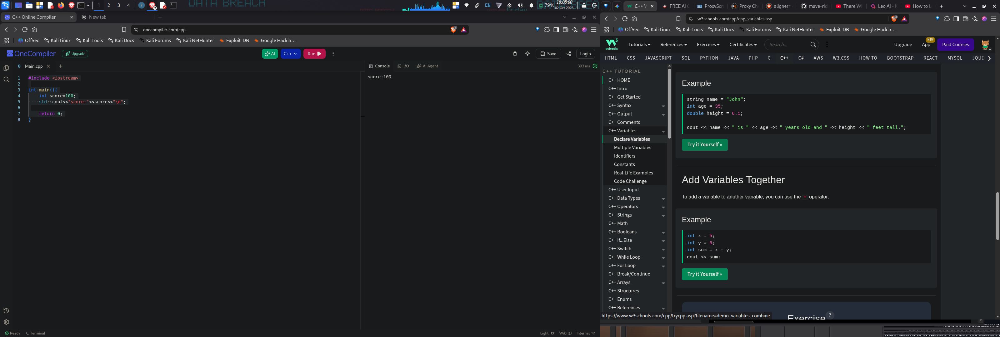
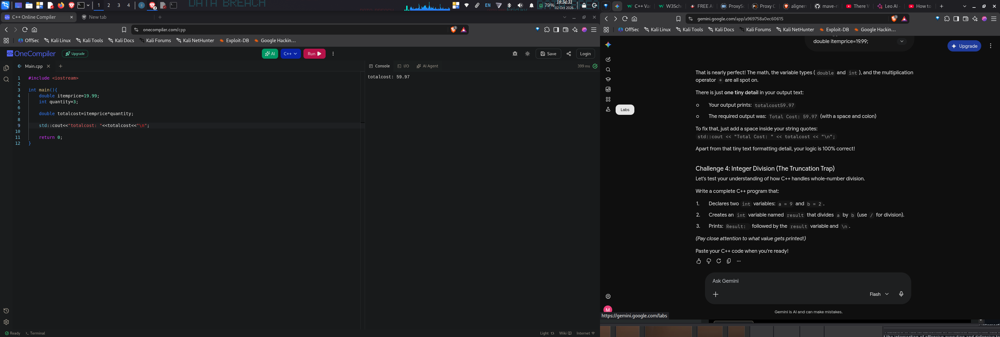

## 🧪 Code Execution & Practice Workflow

To document my C++ programming progression and hands-on lab output, here are screenshots showing step-by-step problem solving, online compiler testing, and interactive challenge verification:

<table align="center" width="100%">
  <tr>
    <td width="50%" align="center" valign="top">
      <h4>🔢 1. Addition Calculator Logic</h4>
      
      
<em>Executing basic user input stream standard input (<code>std::cin</code>) and sum output in OneCompiler.</em>

    </td>
    <td width="50%" align="center" valign="top">
      <h4>⏳ 2. Interactive Input Processing</h4>
      
      
<em>Testing console prompting and step-by-step value handling.</em>

    </td>
  </tr>
  <tr>
    <td width="50%" align="center" valign="top">
      <h4>📊 3. Floating-Point & Double Types</h4>
      
      
<em>Calculating decimal precision, total cost formulas, and line formatting.</em>

    </td>
    <td width="50%" align="center" valign="top">
      <h4>💡 4. Variable Updating & Logic Feedback</h4>
      
      
<em>Practicing integer re-assignment and verifying code structure against exercise prompts.</em>

    </td>
  </tr>
  <tr>
    <td width="50%" align="center" valign="top">
      <h4>📚 5. W3Schools & Concept Reference</h4>
      
      
<em>Studying variable declarations and stream concatenation rules.</em>

    </td>
    <td width="50%" align="center" valign="top">
      <h4>🔍 6. Code Review & Verification</h4>
      
      
<em>Auditing execution results and resolving syntax requirements in real-time.</em>

    </td>
  </tr>
</table>
